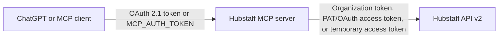

# Hubstaff MCP Server

> Ask ChatGPT about Hubstaff tasks, recent changes, and actual time spent—without handing your Hubstaff credentials to ChatGPT.

[](https://modelcontextprotocol.io/)
[](https://nodejs.org/)
[](https://www.docker.com/)
[](#security)

Hubstaff MCP is a read-only bridge between the official Hubstaff API v2 and ChatGPT or any other MCP client. It turns task and time-tracking data into a conversational interface while keeping Hubstaff secrets on your own server.

Try questions such as:

- “How many hours did the team spend on this task last week?”
- “Which tasks and time records changed today?”
- “Show active tasks for this project and identify where each task came from.”
- “Break down the time on task 123 by team member.”

The server is ready for ChatGPT Developer mode and supports OAuth 2.1, Dynamic Client Registration, Authorization Code + PKCE S256, short-lived JWT access tokens, and rotating refresh tokens. Every MCP tool is read-only.

## Why use it

- **Ask questions instead of assembling reports.** Tasks, updates, source metadata, and tracked time are available through one MCP connection.
- **Keep Hubstaff credentials off the client.** ChatGPT authenticates to your MCP server, not directly to Hubstaff.
- **Choose the right Hubstaff credential.** Organization tokens, PATs, OAuth refresh tokens, and short-lived access tokens are all supported.
- **Run it continuously.** Token rotation is persisted safely, and the project includes Docker, health checks, Traefik labels, and GHCR publishing.
- **Stay read-only.** The server does not create, update, or delete Hubstaff data.

## Hosted endpoint

```text
https://hubstuff-mcp.copperdiver.studio/mcp
```

Health check:

```bash
curl https://hubstuff-mcp.copperdiver.studio/health
```

Expected response:

```json
{
  "status": "ok",
  "hubstaff_configured": true,
  "oauth_configured": true
}
```

The health endpoint never returns secrets.

## How authentication works

There are two separate trust boundaries. Keeping them separate prevents most configuration mistakes.



1. **MCP client → this server** controls who may call the MCP tools.
2. **This server → Hubstaff** controls which Hubstaff data those tools can read.

ChatGPT never receives `HUBSTAFF_*` credentials. It receives only a token issued or accepted by this MCP server.

## Authentication at a glance

| Connection | Best option | Configuration |
|---|---|---|
| ChatGPT → MCP | OAuth 2.1 with DCR and PKCE | `OAUTH_*` |
| Traditional MCP client → MCP | Static bearer token | `MCP_AUTH_TOKEN` |
| MCP → one Hubstaff organization | Organization Access Token | `HUBSTAFF_ORGANIZATION_TOKEN` |
| MCP → a personal Hubstaff account | Personal Access Token | `HUBSTAFF_AUTH_MODE=pat`, `HUBSTAFF_REFRESH_TOKEN` |
| MCP → Hubstaff OAuth application | OAuth refresh token | `HUBSTAFF_AUTH_MODE=oauth`, refresh token, client ID, and client secret |
| MCP → Hubstaff for a short test | Existing access token | `HUBSTAFF_ACCESS_TOKEN` |

Configure one primary Hubstaff authentication method. If `HUBSTAFF_ORGANIZATION_TOKEN` is present, it takes precedence over access and refresh tokens.

## Authenticate MCP clients

### Option A: OAuth 2.1 for ChatGPT

This is the recommended setup for ChatGPT Work and ChatGPT Developer mode. The built-in authorization server provides:

- OAuth discovery metadata;
- Dynamic Client Registration;
- Authorization Code flow;
- PKCE S256;
- audience-bound JWT access tokens;
- rotating refresh grants;
- issuer, audience, expiry, and scope validation.

Configure the public HTTPS origin and a dedicated login for the MCP authorization page:

```dotenv
OAUTH_ISSUER=https://hubstuff-mcp.copperdiver.studio
OAUTH_RESOURCE=https://hubstuff-mcp.copperdiver.studio/mcp
OAUTH_USERNAME=admin
OAUTH_PASSWORD=replace_with_at_least_16_random_characters
OAUTH_SIGNING_SECRET=replace_with_at_least_32_random_characters
OAUTH_STATE_PATH=/data/oauth-state.json
```

`OAUTH_USERNAME` and `OAUTH_PASSWORD` protect this MCP server. They are not Hubstaff account credentials. The current implementation uses one shared MCP login, which is appropriate for a private deployment but not a multi-tenant public service.

The server publishes:

```text
/.well-known/oauth-protected-resource
/.well-known/oauth-protected-resource/mcp
/.well-known/oauth-authorization-server
/oauth/register
/oauth/authorize
/oauth/token
```

### Option B: static bearer token

For scripts, internal agents, or MCP clients that can send a fixed authorization header:

```dotenv
MCP_AUTH_TOKEN=replace_with_at_least_32_random_characters
```

Send it as:

```http
Authorization: Bearer <MCP_AUTH_TOKEN>
```

OAuth and `MCP_AUTH_TOKEN` may be enabled at the same time. If neither is configured, `/mcp` returns a configuration error rather than exposing an unprotected endpoint.

## Authenticate with Hubstaff

The supported Hubstaff features use the official API v2. PAT and OAuth credentials need the following scope:

```text
hubstaff:read
```

### Option 1: Organization Access Token

**Recommended for a long-running service dedicated to one organization.** An Organization Access Token is a long-lived bearer token prefixed with `hsoat_`. It does not require a browser flow or token exchange.

Create it in Hubstaff:

```text
Settings → Organization → API tokens
```

Assign the token to a member with access to the data the server should expose, then configure:

```dotenv
HUBSTAFF_ORGANIZATION_TOKEN=hsoat_replace_me

HUBSTAFF_ACCESS_TOKEN=
HUBSTAFF_REFRESH_TOKEN=
HUBSTAFF_CLIENT_ID=
HUBSTAFF_CLIENT_SECRET=
```

Why choose it:

- no refresh-token rotation;
- the acting organization member can be reassigned;
- expiration can be set to 30, 60, or 90 days, or never;
- well suited to shared automation and always-on services.

### Option 2: Personal Access Token

A PAT is a good fit for a personal integration, internal service, or CI job. Hubstaff displays one value when the PAT is created: that value is a **refresh token**, not an access token.

Create a PAT under:

```text
Hubstaff Account → Personal access tokens
```

Select `hubstaff:read`, then configure:

```dotenv
HUBSTAFF_AUTH_MODE=pat
HUBSTAFF_REFRESH_TOKEN=replace_with_your_pat

HUBSTAFF_ORGANIZATION_TOKEN=
HUBSTAFF_ACCESS_TOKEN=
HUBSTAFF_CLIENT_ID=
HUBSTAFF_CLIENT_SECRET=
```

The server exchanges the PAT for a short-lived access token, reuses that token until it is close to expiry, refreshes it when necessary, and atomically stores the rotated token pair under `TOKEN_CACHE_PATH`.

Do not share the same PAT between multiple applications. Each refresh rotates the token, so another consumer may invalidate the value this server expects.

Do not bind the PAT to DPoP. This server currently uses bearer tokens and does not generate a fresh DPoP proof for every request.

### Option 3: Hubstaff OAuth application

Use this mode when you already have a Hubstaff OAuth application and refresh token:

```dotenv
HUBSTAFF_AUTH_MODE=oauth
HUBSTAFF_REFRESH_TOKEN=replace_with_oauth_refresh_token
HUBSTAFF_CLIENT_ID=replace_with_hubstaff_client_id
HUBSTAFF_CLIENT_SECRET=replace_with_hubstaff_client_secret

HUBSTAFF_ORGANIZATION_TOKEN=
HUBSTAFF_ACCESS_TOKEN=
```

The client ID and secret belong to Hubstaff. They are unrelated to the OAuth server that protects this MCP endpoint.

### Option 4: existing access token

For a short-lived test or debugging session:

```dotenv
HUBSTAFF_ACCESS_TOKEN=replace_with_short_lived_access_token

HUBSTAFF_ORGANIZATION_TOKEN=
HUBSTAFF_REFRESH_TOKEN=
```

The server cannot refresh this token. Use an Organization Access Token or PAT for a permanent deployment.

## Connect ChatGPT Work

1. Confirm the public endpoint uses HTTPS and `/health` reports `oauth_configured: true`.
2. In ChatGPT, open **Settings → Security and login** and enable **Developer mode**.
3. Open the custom apps or connectors page and add:

   ```text
   https://hubstuff-mcp.copperdiver.studio/mcp
   ```

4. Choose OAuth if ChatGPT asks for an authentication method.
5. Complete the authorization page with the server's `OAUTH_USERNAME` and `OAUTH_PASSWORD`.
6. Start a new conversation and ask ChatGPT to list Hubstaff organizations.

If an authorization page expires, close it and start **Connect** or **Retry** again. Authorization requests are short-lived and single-use.

## MCP tools

| Tool | Returns |
|---|---|
| `hubstaff_capabilities` | Supported data sources, known API limits, and whether comments or audit history are available |
| `hubstaff_list_organizations` | Organizations visible to the configured Hubstaff credential |
| `hubstaff_list_tasks` | Organization tasks filtered by status, project, or assignee |
| `hubstaff_get_task` | A full task record plus `project_type`, `integration_id`, and `remote_id` source metadata |
| `hubstaff_recent_updates` | Recently changed tasks and optionally changed activity records |
| `hubstaff_task_hours` | Total tracked time for a task and a per-user breakdown |
| `hubstaff_list_audit_log_entries` | Organization audit events; requires Hubstaff Enterprise and elevated permissions |

All tools are declared read-only, non-destructive, and idempotent.

## Quick start

### Run from source

Requirements: Node.js 22 or later.

```bash
git clone https://github.com/copperdiver/mcp-hubstuff.git
cd mcp-hubstuff
cp .env.example .env
npm ci
npm run build
npm test
npm start
```

The service listens on port `3000` by default:

```text
http://localhost:3000/mcp
http://localhost:3000/health
```

### Run the GHCR image

The image is published as:

```text
ghcr.io/copperdiver/mcp-hubstuff:latest
```

If the package is private, sign in with a GitHub token that has `read:packages`:

```bash
echo "$GHCR_TOKEN" | docker login ghcr.io -u YOUR_GITHUB_USERNAME --password-stdin
docker pull ghcr.io/copperdiver/mcp-hubstuff:latest
```

Skip `docker login` if the package is public.

Run the container:

```bash
docker run --rm \
  --env-file .env \
  -p 3000:3000 \
  -v hubstaff_mcp_data:/data \
  ghcr.io/copperdiver/mcp-hubstuff:latest
```

### Run with Docker Compose and Traefik

The included `compose.yml` expects an external Docker network named `proxy` and a Traefik certificate resolver named `le`.

```bash
docker network create proxy
docker compose up -d --build
```

Adjust the hostname and Traefik labels before deploying under a different domain.

## Complete `.env` example

```dotenv
# Choose one Hubstaff authentication method.
HUBSTAFF_AUTH_MODE=pat
HUBSTAFF_REFRESH_TOKEN=replace_with_your_pat
HUBSTAFF_ORGANIZATION_TOKEN=
HUBSTAFF_ACCESS_TOKEN=
HUBSTAFF_CLIENT_ID=
HUBSTAFF_CLIENT_SECRET=

# Client authentication for the MCP endpoint.
MCP_AUTH_TOKEN=replace_with_at_least_32_random_characters

# OAuth 2.1 for ChatGPT.
OAUTH_ISSUER=https://hubstuff-mcp.copperdiver.studio
OAUTH_RESOURCE=https://hubstuff-mcp.copperdiver.studio/mcp
OAUTH_USERNAME=admin
OAUTH_PASSWORD=replace_with_at_least_16_random_characters
OAUTH_SIGNING_SECRET=replace_with_at_least_32_random_characters
OAUTH_STATE_PATH=/data/oauth-state.json

# Runtime and Hubstaff endpoints.
PORT=3000
HUBSTAFF_API_BASE=https://api.hubstaff.com
HUBSTAFF_TOKEN_URL=https://account.hubstaff.com/access_tokens
TOKEN_CACHE_PATH=/data/token.json
REQUEST_TIMEOUT_MS=30000
```

Never commit `.env`. The repository excludes it from Git and from the Docker build context.

## Persistent data

Two files must survive container recreation:

| Path | Purpose |
|---|---|
| `/data/token.json` | Current Hubstaff access token, rotated refresh token, and expiry time |
| `/data/oauth-state.json` | Registered OAuth clients, authorization codes, and MCP refresh grants |

The included Compose configuration mounts a named volume at `/data`.

## Security

- All MCP tools are read-only.
- The public MCP endpoint requires OAuth, a static bearer token, or both.
- MCP access tokens are checked for issuer, audience, expiry, and scope.
- PKCE S256 protects the authorization-code exchange.
- OAuth callback URLs are restricted to trusted HTTPS callbacks and approved local development URLs.
- Secret values are never returned by `/health`.
- `.env`, OAuth state, and token-cache files must never be committed.
- Secrets are not baked into the Docker image.
- The container runs as the unprivileged `app` user.

For a multi-user deployment, replace the shared `OAUTH_USERNAME` and `OAUTH_PASSWORD` with a real identity provider and maintain a separate Hubstaff credential mapping for each user.

## Hubstaff API limitations

- The Activity API accepts at most seven days per request. `hubstaff_task_hours` splits longer ranges automatically.
- `hubstaff_task_hours` accepts a maximum range of 183 days.
- Detailed activity history depends on Hubstaff retention and your organization plan.
- The public Hubstaff API v2 does not expose task comments. For an integrated task, use `project_type` and `remote_id` to query the source system directly.
- The Audit Log API is available only on Hubstaff Enterprise and requires an Owner or Organization Manager with permission to view other members' data. Audit events do not contain task comments.
- All results remain limited by the permissions of the member represented by the configured Hubstaff credential.

## Troubleshooting

### `hubstaff_configured: false`

No Hubstaff organization token, access token, or refresh token is configured. Update `.env`, then recreate the container:

```bash
docker compose up -d --force-recreate
```

### PAT returns `invalid_grant` or `401`

The PAT may have been refreshed by another application, which invalidated the value stored by this server. Create a dedicated PAT for this deployment and make sure `/data/token.json` is stored on persistent storage.

### `Authorization request expired`

Authorization requests are single-use and expire quickly. Close the old page, start **Connect** or **Retry** in ChatGPT, and submit the newly opened form once.

### ChatGPT does not show the custom app option

Use the ChatGPT web app, enable Developer mode, confirm your plan supports custom apps, and ask the workspace administrator to allow developer-mode apps if necessary.

### Task comments are required

The public Hubstaff API v2 has no task-comments endpoint. Call `hubstaff_get_task`, inspect `project_type` and `remote_id`, then query the source system—for example GitHub, Jira, or Asana. Adding a scope cannot create an endpoint that Hubstaff does not expose.

### Audit Log returns `403`

Audit Log access requires Hubstaff Enterprise. The credential must also represent an Owner or Organization Manager with permission to view other members' data.

### Inspect the container

```bash
docker compose ps
docker compose logs --tail=100
curl http://localhost:3000/health
```

## Development

```bash
npm ci
npm run typecheck
npm test
npm run build
```

The project uses TypeScript, Express, the official MCP TypeScript SDK, JOSE/JWT, Vitest, and a multi-stage Docker build.

## Documentation

- [Hubstaff API](https://developer.hubstaff.com/)
- [Hubstaff authentication](https://developer.hubstaff.com/authentication/)
- [Hubstaff tasks](https://developer.hubstaff.com/reference/tasks/)
- [Hubstaff activities](https://developer.hubstaff.com/reference/activities/)
- [Hubstaff audit log](https://developer.hubstaff.com/reference/audit_log_entries/)
- [OpenAI ChatGPT Developer mode](https://developers.openai.com/api/docs/guides/developer-mode)
- [OpenAI plugin authentication](https://developers.openai.com/plugins/build/auth)
- [Model Context Protocol](https://modelcontextprotocol.io/)
