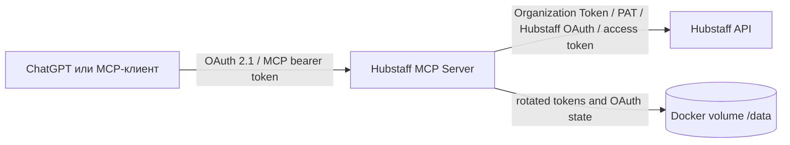

# Hubstaff MCP Server

> Задачи, комментарии, изменения и фактически потраченные часы из Hubstaff — прямо в ChatGPT и любом MCP-клиенте.

[](https://modelcontextprotocol.io/)
[](https://nodejs.org/)
[](https://www.docker.com/)
[](#безопасность)

Hubstaff MCP объединяет **Hubstaff Time Tracking API v2** и **Hubstaff Tasks API v1** в одном удалённом MCP-сервере. Вместо ручных отчётов можно спросить:

- «Сколько часов команда потратила на эту задачу за неделю?»
- «Какие задачи и записи времени изменились сегодня?»
- «Покажи активные задачи проекта и последние комментарии».

Сервер готов для ChatGPT Developer mode: встроены OAuth 2.1, Dynamic Client Registration, Authorization Code + PKCE S256, короткоживущие JWT access tokens и ротируемые refresh tokens. Все MCP-инструменты работают только на чтение.

## Почему этот сервер

- **Один диалог вместо нескольких отчётов.** Задачи, доски, комментарии и время доступны через единый набор инструментов.
- **ChatGPT подключается по OAuth.** Не нужно передавать Hubstaff PAT в ChatGPT или другой MCP-клиент.
- **Подходит для постоянной работы.** Сервер поддерживает Organization Token, PAT с безопасной ротацией и refresh token от Hubstaff OAuth application.
- **Read-only по дизайну.** Инструменты не создают и не изменяют данные Hubstaff.
- **Секреты остаются на вашем сервере.** `.env` исключён из Git и Docker build context, а ротируемые токены сохраняются в защищённом Docker volume.
- **Готов к контейнерному деплою.** Есть multi-stage Docker image, healthcheck, Docker Compose, Traefik labels и публикация в GHCR.

## Готовый endpoint

```text
https://hubstuff-mcp.copperdiver.studio/mcp
```

Healthcheck:

```bash
curl https://hubstuff-mcp.copperdiver.studio/health
```

Ответ настроенного сервера:

```json
{
  "status": "ok",
  "hubstaff_configured": true,
  "oauth_configured": true
}
```

## Как проходит авторизация

У сервера две независимые границы безопасности. Их важно не путать:



1. **MCP-клиент → MCP-сервер.** Определяет, кто может вызывать ваши MCP tools.
2. **MCP-сервер → Hubstaff.** Определяет, какие организации и данные Hubstaff увидит сервер.

ChatGPT никогда не получает `HUBSTAFF_*` credentials. Он получает только ограниченный токен вашего MCP-сервера.

## Быстрый выбор авторизации

### Доступ клиента к MCP

| Сценарий | Способ | Переменные |
|---|---|---|
| ChatGPT Developer mode | **Встроенный OAuth 2.1 + DCR** — рекомендуется | `OAUTH_*` |
| Скрипт, серверный агент или MCP-клиент с custom headers | **Статический bearer token** | `MCP_AUTH_TOKEN` |

### Доступ MCP к Hubstaff

| Сценарий | Способ | Переменные |
|---|---|---|
| Постоянный сервер одной организации | **Organization Access Token** — рекомендуется | `HUBSTAFF_ORGANIZATION_TOKEN` |
| Личный или внутренний сервер | **Personal Access Token (PAT)** | `HUBSTAFF_AUTH_MODE=pat`, `HUBSTAFF_REFRESH_TOKEN` |
| OAuth application с уже полученным refresh token | **Hubstaff OAuth refresh** | `HUBSTAFF_AUTH_MODE=oauth`, `HUBSTAFF_REFRESH_TOKEN`, `HUBSTAFF_CLIENT_ID`, `HUBSTAFF_CLIENT_SECRET` |
| Короткий тест или отладка | **Готовый access token** | `HUBSTAFF_ACCESS_TOKEN` |

Настраивайте ровно один основной способ доступа к Hubstaff. Если задан `HUBSTAFF_ORGANIZATION_TOKEN`, он имеет приоритет.

## Авторизация MCP-клиентов

### Вариант A — OAuth 2.1 для ChatGPT

Это рекомендуемый способ подключения ChatGPT. Сервер поддерживает:

- OAuth protected resource metadata;
- OAuth authorization server metadata;
- Dynamic Client Registration (DCR);
- Authorization Code flow;
- PKCE S256;
- проверку `issuer`, `audience`, срока действия и scope;
- ротируемые refresh tokens;
- callback-specific и stable redirect URI ChatGPT.

Минимальная конфигурация:

```dotenv
OAUTH_ISSUER=https://mcp.example.com
OAUTH_RESOURCE=https://mcp.example.com/mcp
OAUTH_USERNAME=admin
OAUTH_PASSWORD=replace_with_at_least_16_random_characters
OAUTH_SIGNING_SECRET=replace_with_at_least_32_random_characters
OAUTH_STATE_PATH=/data/oauth-state.json
```

`OAUTH_USERNAME` и `OAUTH_PASSWORD` — логин владельца MCP, а не учётная запись Hubstaff. Текущая встроенная реализация рассчитана на один общий MCP-логин. После успешного входа ChatGPT получает scope `hubstaff.read`.

Создать безопасные секреты можно так:

```bash
openssl rand -hex 24   # OAUTH_PASSWORD
openssl rand -hex 48   # OAUTH_SIGNING_SECRET
```

Discovery endpoints:

```text
/.well-known/oauth-protected-resource
/.well-known/oauth-protected-resource/mcp
/.well-known/oauth-authorization-server
/oauth/register
/oauth/authorize
/oauth/token
```

#### Подключение в ChatGPT

1. В веб-версии ChatGPT откройте **Settings → Security and login**.
2. Включите **Developer mode**.
3. Откройте [ChatGPT Plugins](https://chatgpt.com/plugins), нажмите `+` и создайте developer-mode app.
4. Укажите MCP URL: `https://mcp.example.com/mcp`.
5. Выберите **OAuth** и **Dynamic Client Registration (DCR)**. Client ID и Client Secret не требуются.
6. На странице авторизации введите `OAUTH_USERNAME` и `OAUTH_PASSWORD`.
7. После подключения обновите список tools и включите нужные инструменты в чате.

ChatGPT поддерживает Streamable HTTP, OAuth и DCR в Developer mode. Подробности: [OpenAI Developer mode](https://developers.openai.com/api/docs/guides/developer-mode) и [OAuth authentication](https://developers.openai.com/plugins/build/auth).

### Вариант B — статический MCP bearer token

Подходит для клиентов, умеющих отправлять собственный HTTP header:

```dotenv
MCP_AUTH_TOKEN=replace_with_at_least_32_random_characters
```

Запросы должны содержать:

```http
Authorization: Bearer <MCP_AUTH_TOKEN>
```

Пример общей конфигурации MCP-клиента:

```json
{
  "mcpServers": {
    "hubstaff": {
      "url": "https://mcp.example.com/mcp",
      "headers": {
        "Authorization": "Bearer ${MCP_AUTH_TOKEN}"
      }
    }
  }
}
```

Если OAuth и `MCP_AUTH_TOKEN` настроены одновременно, сервер принимает оба способа. Если не настроен ни один, публичный `/mcp` не запускается без защиты и отвечает ошибкой конфигурации.

## Авторизация в Hubstaff

Hubstaff официально поддерживает Organization Access Tokens, Personal Access Tokens и OAuth applications. Для чтения всех функций этого сервера PAT/OAuth credential должен включать scopes:

```text
hubstaff:read tasks:read
```

### Вариант 1 — Organization Access Token

**Лучший выбор для production-сервера одной организации.** Это долгоживущий bearer token с префиксом `hsoat_`, который не требует browser flow или refresh exchange.

Создать токен может owner, manager или участник с правом Manage IT:

```text
Hubstaff → Settings → Organization → API tokens
```

Токен работает от имени назначенного участника и наследует его текущие права в организации.

```dotenv
HUBSTAFF_ORGANIZATION_TOKEN=hsoat_replace_me

HUBSTAFF_ACCESS_TOKEN=
HUBSTAFF_REFRESH_TOKEN=
HUBSTAFF_CLIENT_ID=
HUBSTAFF_CLIENT_SECRET=
```

Преимущества:

- нет ротации refresh token;
- можно назначить или переназначить ответственного участника;
- можно выбрать срок 30, 60, 90 дней или `Never`;
- хорошо подходит для shared automation и постоянно работающего сервера.

### Вариант 2 — Personal Access Token (PAT)

PAT подходит для личной интеграции, внутреннего инструмента или CI. Важная особенность Hubstaff: строка, показанная при создании PAT, является **refresh token**, а не готовым access token.

Создайте PAT в:

```text
Hubstaff Account → Personal access tokens
```

Выберите scopes `hubstaff:read` и `tasks:read`, затем настройте:

```dotenv
HUBSTAFF_AUTH_MODE=pat
HUBSTAFF_REFRESH_TOKEN=replace_with_your_pat

HUBSTAFF_ORGANIZATION_TOKEN=
HUBSTAFF_ACCESS_TOKEN=
HUBSTAFF_CLIENT_ID=
HUBSTAFF_CLIENT_SECRET=
```

Не привязывайте PAT к DPoP key: текущая версия сервера использует обычный Bearer flow и не генерирует DPoP proof для каждого запроса.

Сервер автоматически:

1. обменяет PAT на короткоживущий access token;
2. переиспользует access token до истечения срока;
3. сохранит новую пару access/refresh tokens в `/data/token.json`;
4. атомарно заменит файл после следующей ротации.

Не используйте один PAT одновременно в нескольких приложениях: Hubstaff ротирует refresh token, и приложения будут инвалидировать credentials друг друга.

> После первого обмена исходный PAT в `.env` может стать неактуальным. Не удаляйте volume с `/data/token.json`, пока не готовы выпустить новый PAT.

### Вариант 3 — Hubstaff OAuth application

Этот режим нужен, если вы зарегистрировали OAuth application в Hubstaff и уже получили refresh token через Authorization Code flow.

```dotenv
HUBSTAFF_AUTH_MODE=oauth
HUBSTAFF_REFRESH_TOKEN=replace_with_oauth_refresh_token
HUBSTAFF_CLIENT_ID=replace_with_hubstaff_client_id
HUBSTAFF_CLIENT_SECRET=replace_with_hubstaff_client_secret

HUBSTAFF_ORGANIZATION_TOKEN=
HUBSTAFF_ACCESS_TOKEN=
```

Сервер использует HTTP Basic с `client_id:client_secret` при обновлении токена и сохраняет ротируемые credentials в `/data/token.json`.

Этот проект не предоставляет отдельный callback UI для первоначального Hubstaff consent flow. Сначала получите authorization code и refresh token через вашу Hubstaff OAuth application, затем передайте refresh token серверу.

Не путайте этот режим со встроенным `OAUTH_*` для ChatGPT:

- `HUBSTAFF_CLIENT_ID` / `HUBSTAFF_CLIENT_SECRET` относятся к Hubstaff;
- `OAUTH_ISSUER` / `OAUTH_USERNAME` / `OAUTH_PASSWORD` защищают MCP от неавторизованных клиентов.

### Вариант 4 — готовый Hubstaff access token

Подходит только для короткого теста:

```dotenv
HUBSTAFF_ACCESS_TOKEN=replace_with_short_lived_access_token

HUBSTAFF_ORGANIZATION_TOKEN=
HUBSTAFF_REFRESH_TOKEN=
```

Сервер не сможет обновить такой токен без refresh token. После истечения срока Hubstaff начнёт отвечать `401`, поэтому для production используйте Organization Token, PAT или OAuth refresh mode.

Полная схема Hubstaff authentication: [developer.hubstaff.com/authentication](https://developer.hubstaff.com/authentication/).

## MCP tools

| Tool | Что возвращает |
|---|---|
| `hubstaff_list_organizations` | Доступные организации и их ID |
| `hubstaff_list_tasks` | Задачи организации с фильтрами по status, project и user |
| `hubstaff_get_task` | Полную карточку time-tracking задачи |
| `hubstaff_recent_updates` | Недавно изменённые задачи и записи времени |
| `hubstaff_task_hours` | Общее время по задаче и разбивку по пользователям |
| `hubstaff_tasks_list_projects` | Проектные доски Hubstaff Tasks |
| `hubstaff_tasks_list_project_tasks` | Задачи выбранной доски |
| `hubstaff_tasks_get_task` | Подробности задачи Hubstaff Tasks |
| `hubstaff_tasks_list_comments` | Комментарии или встроенную историю задачи |

Все tools объявлены как `readOnly`, `non-destructive` и `idempotent`.

## Быстрый старт

### 1. Запуск из исходников

Требования: Node.js 22+.

```bash
git clone https://github.com/copperdiver/mcp-hubstuff.git
cd mcp-hubstuff
cp .env.example .env
```

Заполните `.env`, затем:

```bash
npm ci
npm run build
npm test
npm start
```

Локальный endpoint:

```text
http://localhost:3000/mcp
```

### 2. Запуск готового image из GHCR

Если package закрытый, сначала авторизуйтесь с GitHub token, имеющим permission `read:packages`. Для публичного package этот шаг не нужен:

```bash
echo "$GHCR_TOKEN" | docker login ghcr.io -u YOUR_GITHUB_USERNAME --password-stdin
```

```bash
docker pull ghcr.io/copperdiver/mcp-hubstuff:latest

docker run -d \
  --name hubstaff-mcp \
  --restart unless-stopped \
  -p 3000:3000 \
  --env-file .env \
  -v hubstaff_mcp_data:/data \
  ghcr.io/copperdiver/mcp-hubstuff:latest
```

Кроме `latest`, workflow публикует immutable tag `sha-<full-commit-sha>`.

### 3. Docker Compose + Traefik

Скопируйте `.env.example` в `.env`, настройте домен в `compose.yml` и создайте внешнюю proxy network, если её ещё нет:

```bash
docker network create proxy
docker compose up -d --build
```

Для production значения должны совпадать:

```dotenv
OAUTH_ISSUER=https://mcp.example.com
OAUTH_RESOURCE=https://mcp.example.com/mcp
```

Traefik должен завершать TLS, потому что публичный OAuth issuer обязан работать по HTTPS.

## Полный пример `.env`

Пример с ChatGPT OAuth и Hubstaff PAT:

```dotenv
# Client → MCP
MCP_AUTH_TOKEN=replace_with_at_least_32_random_characters

OAUTH_ISSUER=https://mcp.example.com
OAUTH_RESOURCE=https://mcp.example.com/mcp
OAUTH_USERNAME=admin
OAUTH_PASSWORD=replace_with_at_least_16_random_characters
OAUTH_SIGNING_SECRET=replace_with_at_least_32_random_characters
OAUTH_STATE_PATH=/data/oauth-state.json

# MCP → Hubstaff
HUBSTAFF_AUTH_MODE=pat
HUBSTAFF_REFRESH_TOKEN=replace_with_your_pat
HUBSTAFF_ORGANIZATION_TOKEN=
HUBSTAFF_ACCESS_TOKEN=
HUBSTAFF_CLIENT_ID=
HUBSTAFF_CLIENT_SECRET=

# Runtime
PORT=3000
HUBSTAFF_API_BASE=https://api.hubstaff.com
HUBSTAFF_TOKEN_URL=https://account.hubstaff.com/access_tokens
TOKEN_CACHE_PATH=/data/token.json
REQUEST_TIMEOUT_MS=30000
```

## Хранение данных и секретов

В `/data` находятся два runtime-файла:

| Файл | Содержимое |
|---|---|
| `/data/token.json` | Текущий Hubstaff access token, rotated refresh token и expiry |
| `/data/oauth-state.json` | DCR clients, authorization codes и refresh grants MCP OAuth |

Оба файла создаются с правами `0600`. Каталог `/data` должен быть постоянным Docker volume.

Никогда не публикуйте:

- `.env`;
- `/data/token.json`;
- `/data/oauth-state.json`;
- значения `MCP_AUTH_TOKEN`, `OAUTH_PASSWORD`, `OAUTH_SIGNING_SECRET` или `HUBSTAFF_*TOKEN`.

`.gitignore` и `.dockerignore` уже исключают эти данные. Не используйте `docker compose down -v`, если хотите сохранить rotated tokens и активные OAuth connections.

## Безопасность

- Все бизнес-инструменты работают только на чтение.
- Публичный MCP endpoint требует OAuth token или `MCP_AUTH_TOKEN`.
- OAuth access tokens проверяются по issuer, audience, expiry и scope.
- Authorization Code защищён PKCE S256 и одноразовым кодом.
- Callback URI ограничены доверенными доменами ChatGPT/OpenAI.
- Access tokens короткоживущие, refresh tokens ротируются.
- Секреты не встраиваются в Docker image.
- Контейнер работает от непривилегированного пользователя `app`.

Для multi-user production deployment вместо общего `OAUTH_USERNAME`/`OAUTH_PASSWORD` рекомендуется подключить полноценный identity provider и хранить отдельную привязку Hubstaff credential к каждому пользователю.

## Ограничения Hubstaff

- Activity API принимает интервал не более 7 дней за запрос; `hubstaff_task_hours` автоматически разбивает длинный период на части.
- Диапазон `hubstaff_task_hours` ограничен 183 днями.
- Детальная история активности зависит от доступного периода Hubstaff и тарифа организации.
- Comments API относится к Hubstaff Tasks и может быть недоступен на некоторых тарифах. Tool сначала проверяет dedicated endpoint, затем ищет comments/history в данных задачи.
- Доступ к организациям и проектам всегда ограничен правами пользователя или участника, которому принадлежит Hubstaff credential.

## Troubleshooting

### `hubstaff_configured: false`

Не задан ни один `HUBSTAFF_ORGANIZATION_TOKEN`, `HUBSTAFF_REFRESH_TOKEN` или `HUBSTAFF_ACCESS_TOKEN`. После изменения `.env` пересоздайте контейнер:

```bash
docker compose up -d --force-recreate
```

### PAT возвращает `invalid_grant` или `401`

PAT уже мог быть использован другим приложением и ротирован. Выпустите отдельный PAT для этого сервера и не разделяйте его между несколькими consumers.

### `Authorization request expired`

Authorization request одноразовый и действует ограниченное время. Закройте старую страницу, запустите **Connect/Retry** в ChatGPT и отправьте новую форму один раз.

### ChatGPT не показывает кнопку `+`

Проверьте, что вы используете веб-версию ChatGPT, включили **Developer mode**, ваш план поддерживает эту функцию, а workspace administrator разрешил developer-mode apps.

### Комментарии задачи не возвращаются

Убедитесь, что PAT/OAuth credential имеет scope `tasks:read`, пользователь видит проект, а тариф Hubstaff предоставляет comments/history через Tasks API.

### Проверка контейнера

```bash
docker compose ps
docker compose logs --tail=100
curl http://localhost:3000/health
```

## Разработка

```bash
npm ci
npm run typecheck
npm test
npm run build
```

Основной стек:

- TypeScript + Node.js;
- official MCP TypeScript SDK;
- Express + Streamable HTTP;
- JOSE/JWT;
- Vitest;
- Docker/BuildKit.

## Документация

- [Hubstaff API](https://developer.hubstaff.com/)
- [Hubstaff authentication](https://developer.hubstaff.com/authentication/)
- [Hubstaff tasks](https://developer.hubstaff.com/reference/tasks/)
- [Hubstaff activities](https://developer.hubstaff.com/reference/activities/)
- [OpenAI ChatGPT Developer mode](https://developers.openai.com/api/docs/guides/developer-mode)
- [OpenAI plugin authentication](https://developers.openai.com/plugins/build/auth)
- [Model Context Protocol](https://modelcontextprotocol.io/)
